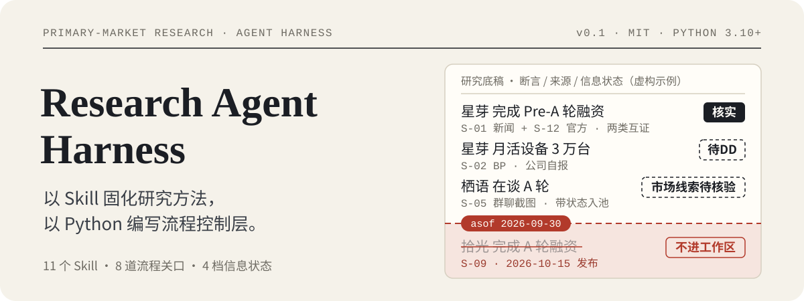
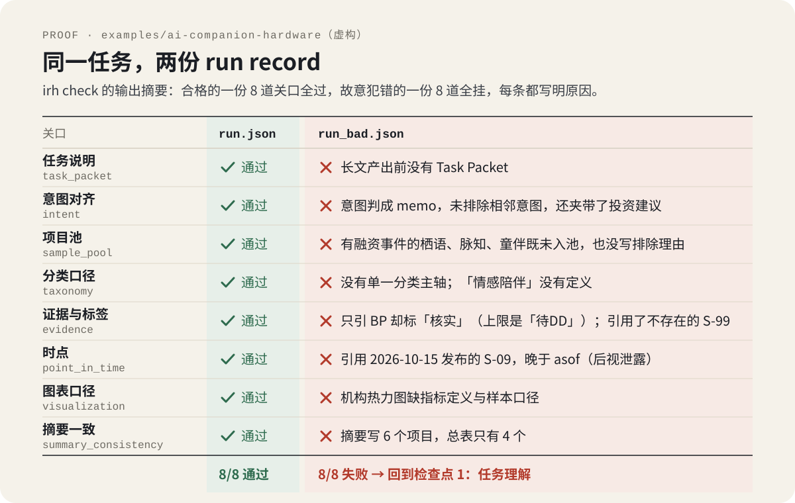
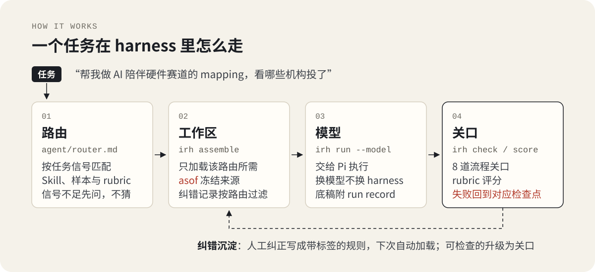
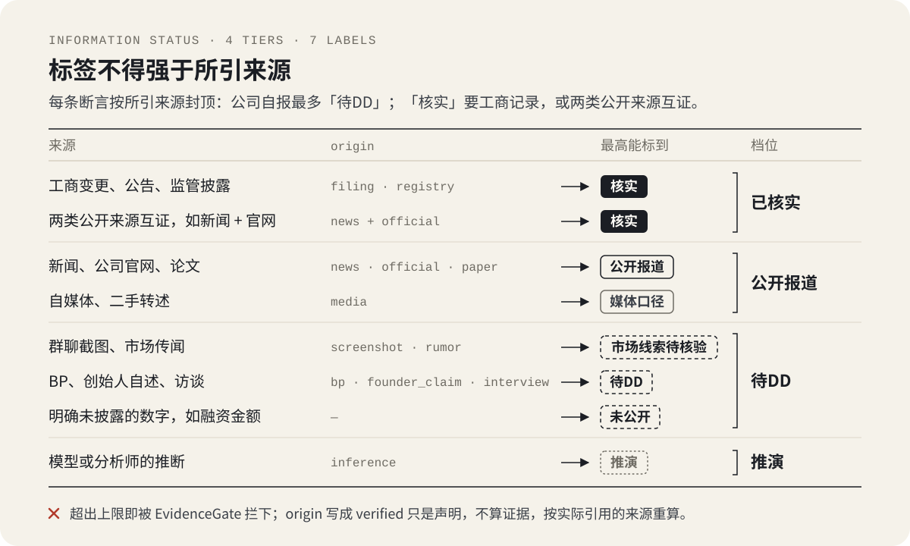

<p align="center">
  
</p>

<p align="center">
  <a href="https://github.com/xxxxm12138/research-agent-harness/actions/workflows/ci.yml"></a>
  
  
  <a href="LICENSE"></a>
</p>

**以 Skill 固化研究方法，以 Python 编写流程控制层。** 方法写成 agent 读的 markdown；必须守住、不能指望模型自觉的规则写成代码：路由、工作区装配、时点冻结、信息状态、流程关口、评分、纠错记录。

> 本仓库只包含框架、方法与虚构示例，不含任何真实项目、交易、客户或会议信息。见 [DISCLAIMER](DISCLAIMER.md)。

<p align="center">
  
</p>

上图来自虚构示例 [`examples/ai-companion-hardware/`](examples/ai-companion-hardware/)，复现命令见[快速开始](#快速开始)。

## 背景与需求

我在一级市场 FA 机构 AI 组（投研实习）负责前沿赛道跟踪与早期项目尽调。用通用大模型做赛道 Mapping 与标的梳理时，主要遇到三类问题：

1. **分类维度混用**：技术路线、产品形态、融资阶段混在一套分类里，图谱结构混乱；
2. **早期项目漏检**：检索偏向公开信息，只出现在截图、访谈、BP 里的早期项目被漏掉；
3. **单方数据当事实**：直接采信 BP 的自报数据，缺少交叉验证。

所以模型输出只能当初稿素材；高频任务还要每次手动指定 Skill，效率低。每个问题在这里对应一条机制，并由代码检查：

| 问题 | 机制 | 由谁检查 |
|---|---|---|
| 分类维度混用 | 只沿一条主轴分类，每个类别写清定义与边界 | `TaxonomyGate`；rubric「Coordinate system」 |
| 早期项目漏检 | 先锁项目池再写画像；时点内出现过融资事件的项目必须入池或写明排除理由；截图、访谈线索带状态入池，而不是被丢掉 | `PoolGate`（含覆盖检查） |
| 单方数据当事实 | 标签不得强于所引来源；BP、访谈、截图默认落在「待DD」档；「核实」需要工商记录，或两类独立公开来源相互印证 | `EvidenceGate` + `provenance.ceiling_for_sources` |
| 每次手动指定 Skill | 路由表按任务信号自动匹配 Skill 与参考样本 | `agent/router.md` + `irh route` |

<p align="center">
  
</p>

## 方法层：Skill 化与任务路由

投研方法拆成 11 个 Skill（`skills/`），每个都写明适用场景、执行步骤、输出规范、铁律与常见失误：

| Skill | 做什么 |
|---|---|
| `research-mapping` | 赛道 / 项目 Mapping 底稿：边界 → 主轴 → 项目池 → 总表 → 机构与项目画像 → 来源附录 |
| `track-analysis` | 赛道研判与投资备忘录：断言-证据-推论-含义，inflection 事件表，六节研判骨架 |
| `founder-diligence` | 创始人 / 团队背调：只用职业与公开信息，事实层与分析层分离 |
| `call-report` | 会议录音 → 标准 Call Report：只呈现事实，判断留给打分表 |
| `deal-modeling` | Cap table 与估值建模：先读法律文件，能推导的数字一律写公式 |
| `deal-screening` | 项目快速筛选：五个必问，Push Forward / Watch / Pass + 下一步 |
| `landscape-visualization` | 底表 → 研报风格市场格局图（PNG / 交互 HTML） |
| `narrative` · `thinker` | 融资叙事框架；判断前的"磨刀石"自我质询 |
| `style-replication` · `thinking-style-recognition` | 常驻加载：研究员的质量标准与提问 / 纠正习惯 |

路由表 [`agent/router.md`](agent/router.md) 既是给 agent 读的文档，也是代码直接解析的配置：

```text
$ irh route "帮我做 AI 陪伴硬件赛道的 mapping，看哪些机构投了"
route    : mapping
intent   : mapping 底稿
skills   : skills/research-mapping/SKILL.md, skills/track-analysis/SKILL.md
golden   : agent/golden/mapping.md
rubric   : agent/evals/rubrics/mapping.md
```

## 意图识别与对齐

同一句"看看这个赛道"，可能要的是 Mapping 底稿、投资备忘录或口头汇报；误判交付物是最常见的失误。对齐分三层：

1. **意图分类**：动笔前先判定任务类型，并明确排除相邻类型。路由表的 `Not` 列写着每类任务必须排除的相邻意图（mapping 底稿 ≠ memo、≠ 投资建议、≠ FA 匹配），`IntentGate` 检查 run record 里是否逐一排除。信号不足以判断时不猜：

   ```text
   $ irh route "帮我看看这个赛道"
   no route: no task signal matched; ask one concise clarifying question
   ```

2. **任务说明（Task Packet）**：复杂任务先写核心问题、读者决策、证据标准与翻转条件，确认后再进正文；`TaskPacketGate` 拒收没有这些字段的产出。
3. **纠偏触发**：执行中出现"不是""理解错了""先和我确认"等信号，立即停止当前方向，回到对应检查点：

   ```text
   $ irh correction "不是，你需要先和我确认任务需求"
   - Signal: `先和我确认` -> checking whether the task frame is right before any long-form writing
   - I will now return to checkpoint: 1 (Task Understanding)
   - Next artifact: Task Packet and structure only
   ```

## 工作区设计

每个任务装配一个独立工作区，从源头控制模型能看到什么：

- **按需加载**：只加载该路由需要的 Skill、参考样本，以及与该路由相关的纠错记录；缺失的必要文件显式列出，不默认已读。
- **时点冻结（as-of）**：设定决策日期，之后发布的来源不写进工作区，模型看不到；事后引用也会被 `TemporalGate` 拦下。
- **信息状态标注**：四档：已核实 / 公开报道 / 待DD / 推演（细分 7 个标签）。BP、访谈、截图默认落在「待DD」档；标签按所引来源封顶，从数据层面杜绝把公司单方说法当作事实。

<p align="center">
  
</p>

```text
$ irh assemble "帮我做 AI 陪伴硬件赛道的 mapping，看哪些机构投了" --asof 2026-09-30 \
    --sources examples/ai-companion-hardware/sources.json --out runs/demo
route mapping (mapping 底稿) | asof 2026-09-30
  [rules ] agent/playbook.md  ~2089 tok
  ...
  [skill ] skills/research-mapping/SKILL.md  ~2982 tok
  [golden] agent/golden/mapping.md  ~588 tok
context ~15226 / 60000 tokens
corrections            : 10 loaded, 1 skipped for this route
sources admitted       : S-01, S-02, S-03, S-04, S-05, S-06, S-07, S-08, S-10, S-11, S-12, S-13
excluded (after asof)  : S-09
undated (admitted)     : S-11
```

纠错记录同样按任务过滤：每条都带 `Applies to` 标签，任务只加载与自己相关的规则和通用规则。比如写 CR 时，mapping 的分类、项目池规则不会进上下文，模型也就不会把它们套到会议纪要上。

## 纠错沉淀

每次人工纠正都沉淀为一条带 `Applies to` 标签的规则（[`agent/memory/corrections.md`](agent/memory/corrections.md)），之后同类任务自动加载；能从产出里检查的规则，再升级成代码关口。例如一次 AI 情绪经济 Mapping 出现分类混乱与项目遗漏后，形成三条规则：

| 规则 | 纠错记录 | 代码关口 |
|---|---|---|
| 分类只沿一条主轴 | 2026-06-24 Classification needs one primary axis | `TaxonomyGate` |
| 先锁定项目池，再写项目画像 | 2026-06-24 Project pool completeness comes before profile writing | `PoolGate` |
| 公司自报数据一律标为待核实 | 2026-06-24 Sources and DD status must be explicit | `EvidenceGate` |

使用中的训练循环见 [`agent/training_loop.md`](agent/training_loop.md)：10 分钟复盘 → Correction Card → Golden Candidate → 每周把高质量产出升为样本、把代表性失误升为评测用例。

## 效果与体会

Agent 已支撑 50 多个项目的研判，产出从需要大幅修改的初稿，演进为补充判断即可使用的研究底稿。真实项目材料属于保密信息，不在本仓库。“可用”的标准写成了一张评分表（rubric）：一份产出按 7 个维度打分，连续三次真实任务都拿到 12 分以上（满分 14）才算可用。

能写成规则的交给代码，判断留给人：曾经设计过的"自动写 IC memo"环节被砍掉，因为模型写出的投资判断没有信息量。Skill 是脚手架，不是打分器。

## 与金融大模型评测 / 后训练的对应

这套 harness 本身就是一个小型的评测与数据生产环境：

| Harness | 评测 / 后训练里的对应 |
|---|---|
| 路由表与意图 | 任务分类体系（能力定义） |
| 杂乱输入 → Intent Gate + Task Packet | query 改写与意图识别 |
| 时点工作区 + 来源分级 | 信息环境构造：噪声、缺口、防泄露 |
| 8 个流程关口 | 过程监督 / 可验证的过程奖励 |
| rubric（规则维度 + judge 维度） | 结果评分：可验证项 + LLM-as-judge |
| golden 样本 / 失败用例 / 纠错记录 | SFT 示范 / 偏好对 / 错误分类 |
| `irh run --model` | 同一 harness 下的模型对比 |

展开见 [`docs/benchmark-alignment.md`](docs/benchmark-alignment.md)；设计与模块边界见 [`docs/architecture.md`](docs/architecture.md)。

---

## 快速开始

```bash
git clone https://github.com/xxxxm12138/research-agent-harness.git
cd research-agent-harness
python -m venv .venv && source .venv/bin/activate
pip install -e ".[dev]"            # 核心无第三方依赖；可视化另装 ".[viz]"
make check                          # lint + tests + validate + scan
```

用虚构示例跑一遍完整流程（`examples/ai-companion-hardware/`）：

```bash
E=examples/ai-companion-hardware
irh check $E/run.json     --sources $E/sources.json   # 合格的 run record：8 个关口全过
irh check $E/run_bad.json --sources $E/sources.json   # 故意犯错：8 个关口全挂，回到检查点 1
irh score $E/run.json     --sources $E/sources.json   # 规则可评 6 维共 12 分 -> pass；判断质量待 judge
```

<details>
<summary><code>run_bad.json</code> 被拦下的几条（<code>irh check</code> 原始输出节选）</summary>

```text
[FAIL] intent
       - Intent Gate does not rule out adjacent intent(s): memo, 投资建议, FA 匹配
[FAIL] sample_pool
       - financed project '栖语' (S-05) is neither in the pool nor excluded
[FAIL] evidence
       - labelled '核实' but cited sources (S-02) support at most '待DD': 星芽月活设备 3 万台，商业化已验证
[FAIL] point_in_time
       - '拾光已完成 A 轮融资，估值大幅提升' uses S-09, published 2026-10-15, after asof 2026-09-30 (look-ahead leakage)
return to checkpoint 1: Task Understanding
```

</details>

## 换模型跑同一套 harness（Pi）

`irh run` 把工作区落盘，再交给 [Pi](https://www.npmjs.com/package/@earendil-works/pi-coding-agent)（只有 read / write / edit / bash 四个工具的极简 agent harness）执行：规则作为 system prompt，Skill 作为 `--skill`，参考样本、输出契约与时点内来源作为附件；模型输出末尾的 JSON run record 被自动抽取并过关口。模型只是一个参数：

```bash
irh run "帮我做 AI 陪伴硬件赛道的 mapping，看哪些机构投了" --asof 2026-09-30 \
  --sources examples/ai-companion-hardware/sources.json --model deepseek/deepseek-chat
```

同一任务、同一工作区、不同 `--model`，关口与 rubric 结果可以直接比较，便于区分问题出在模型还是出在 harness。配置见 [`pi/README.md`](pi/README.md)。

## 仓库结构

```text
agent/            控制层：路由表、playbook、检查点、Task Packet、run record 契约、记忆、评测
skills/           方法层：11 个 Skill（含参考模板、脚本、评测说明）
src/ir_harness/   代码层：router / workspace / provenance / gates / rubric / corrections / compliance / pi_runner / cli
examples/         虚构的端到端示例：来源、合格与不合格的 run record、报告、格局图数据
docs/             架构、与评测/后训练的对应、合规说明
pi/               Pi 适配：模型配置样例、运行脚本
tools/            docx → 文本（标准库实现）
tests/            单元测试 + 文档即配置的一致性测试
```

| 命令 | 作用 |
|---|---|
| `irh route` | 任务 → 路由、Skill、样本、rubric |
| `irh assemble` | 装配时点工作区；`--out` 落盘 |
| `irh check` | 对 run record 跑 8 个流程关口，失败时给出要回到的检查点 |
| `irh score` | 按路由的 rubric 打分（规则维度 + judge 维度） |
| `irh correction` | 识别纠偏信号，输出 Correction Capture |
| `irh run` | 落盘工作区并通过 Pi 调用模型，再过关口 |
| `irh validate` | 路由引用、rubric、文档里的路径、Skill frontmatter、评测用例与路由是否一致 |
| `irh scan` | 发布前合规扫描：密钥、本地路径、私有链接、保密文件类型、本地名单 |

## 工程与合规

- **测试**：`pytest` 覆盖路由、工作区、来源分级、关口、评分、纠错、合规扫描、Pi 命令构造、CLI 与示例数据；示例里的 cap table 算术也由测试校验。
- **文档即配置**：`irh validate` 解析路由表、rubric 与评测用例，并检查所有文档中引用的路径都存在。
- **CI**：GitHub Actions 在 Python 3.10–3.12 上跑 lint、测试、validate 与 scan。
- **合规**：真实材料（BP、CR、访谈、cap table、录音）永不入库；发布前 `irh scan` 检查密钥、本地路径、私有文档链接、保密文件类型，以及本地 gitignore 的名单。见 [`docs/research-compliance.md`](docs/research-compliance.md)。

## 局限

- 关口检查的是形式与来源纪律，不是事实真伪；数字对不对，仍要人对照来源抽查。
- 判断质量这一维需要 LLM judge 或人工打分，未打分时结论标为 `provisional`。
- 时点冻结只约束交给模型的材料，约束不了模型预训练里已有的知识；评测时需要选用模型知识截止日之后的事件，或对实体做匿名化。
- 路由信号是关键词匹配，遇到新说法需要在路由表里补信号；匹配不上时 agent 会先问，而不是猜。

## License

[MIT](LICENSE)
