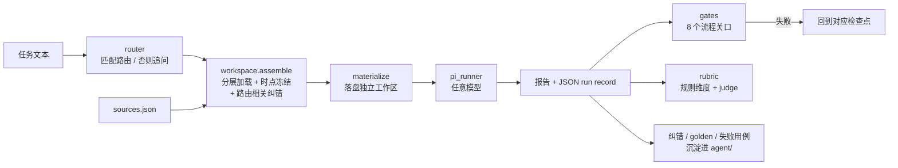

# 架构

一句话：**Agent = Model + Harness。** 模型负责在每一步里干活；harness 决定它看到什么、按什么顺序做、产出怎么被检查、错误怎么被记住。这个仓库就是 harness，模型是可替换的参数。

## 三层

```text
┌──────────────────────────────────────────────────────────────┐
│ 控制层 agent/        路由表 · playbook · 检查点 · Task Packet │
│                      run record 契约 · 记忆 · golden · 评测    │
├──────────────────────────────────────────────────────────────┤
│ 方法层 skills/       11 个 Skill：步骤、模板、铁律、常见失误   │
├──────────────────────────────────────────────────────────────┤
│ 代码层 src/          把"不能靠模型自觉"的规则执行掉              │
└──────────────────────────────────────────────────────────────┘
```

markdown 是唯一的规则来源。代码不另写一份规则，而是**解析** markdown：路由来自 `agent/router.md` 的表格，rubric 维度和及格线来自 `agent/evals/rubrics/*.md`，纠错记录的适用范围来自每条记录的 `Applies to`。改规则只改文档，`irh validate` 保证文档里写的路径、用例与路由一致。

## 一次任务的数据流



## 模块

| 模块 | 职责 | 读的文档 |
|---|---|---|
| `mdtable` | 解析 markdown 的章节、表格、反引号 | — |
| `router` | 任务信号 → 路由；平票按表格顺序；无信号抛 `RoutingError`（= 先问） | `agent/router.md` |
| `workspace` | 分层加载（rules → skill → golden），记录缺失文件；按路由筛纠错记录；按 `asof` 剔除来源；`materialize` 落盘 | `agent/router.md`、`agent/memory/corrections.md` |
| `provenance` | 7 个信息状态标签、4 档；origin 上限；按所引来源封顶与交叉验证规则 | `agent/run_record_contract.md` |
| `run_record` | 解析模型产出的 JSON run record | `agent/run_record_contract.md` |
| `gates` | 8 个流程关口，失败时给出要回到的检查点 | `agent/playbook.md`、`agent/checkpoint_workflow.md` |
| `rubric` | 解析 rubric；6 个维度按规则打分，判断质量交给 judge；`provisional` 结论 | `agent/evals/rubrics/mapping.md` |
| `corrections` | 纠偏信号识别；纠错记录的解析、按标签筛选与追加 | `agent/memory/corrections.md` |
| `pi_runner` | 工作区 → Pi 命令行；抽取 run record | — |
| `repo_check` | 文档引用、Skill frontmatter、评测用例与路由的一致性 | 所有 `*.md` |
| `compliance` | 发布前扫描 | `.sensitive-terms.txt`（本地，gitignore） |

核心包没有第三方依赖，Python 3.10+。

## 8 个关口

| 关口 | 检查什么 | 失败回到 |
|---|---|---|
| `task_packet` | Task Packet 存在，核心问题、读者决策、交付物、证据标准、翻转条件齐全 | 1 任务理解 |
| `intent` | 路由与意图一致；路由 `Not` 列的相邻意图已逐一排除；mapping 底稿不含未被要求的投资结论 | 1 任务理解 |
| `sample_pool` | 画像前已锁池；画像对象都在池里；每条有入池理由；时点内有融资事件的项目都入池或写明排除理由 | 2 样本池 |
| `taxonomy` | 有唯一主轴；每个类别有定义；池中类别都已定义 | 3 分类口径 |
| `evidence` | 事实有来源；标签不强于声明来源与所引来源；`核实` 需工商记录或两类公开来源印证；不引用不存在的来源 | 5 正文 |
| `point_in_time` | 没有引用 `asof` 之后发布的来源 | 5 正文 |
| `visualization` | 每张图有结论、指标口径、样本基数 | 5 正文 |
| `summary_consistency` | 摘要计数与最终总表一致 | 5 正文 |

多个关口失败时，回到编号最小的检查点：先把任务理解对，再谈别的。

## 扩展点

- **加路由**：在 `agent/router.md` 的 Routes 表加一行；`irh validate` 会检查引用的文件都存在。
- **加关口**：在 `gates.py` 继承 `Gate`，实现 `errors()`，加入 `DEFAULT_GATES`；在 playbook 的 Enforcement 表登记。
- **加 rubric 维度**：在 rubric 表格加一行；能从 run record 判断的，在 `rubric.RULE_SCORERS` 加一个打分函数，否则交给 judge。
- **接 judge**：`score(..., judge=fn)`，`fn(dimension, run) -> 0..2 | None`，可以是 LLM-as-judge，也可以是人工打分表。
- **换模型**：`irh run --model provider/id`；Pi 的模型配置见 `pi/README.md`。
